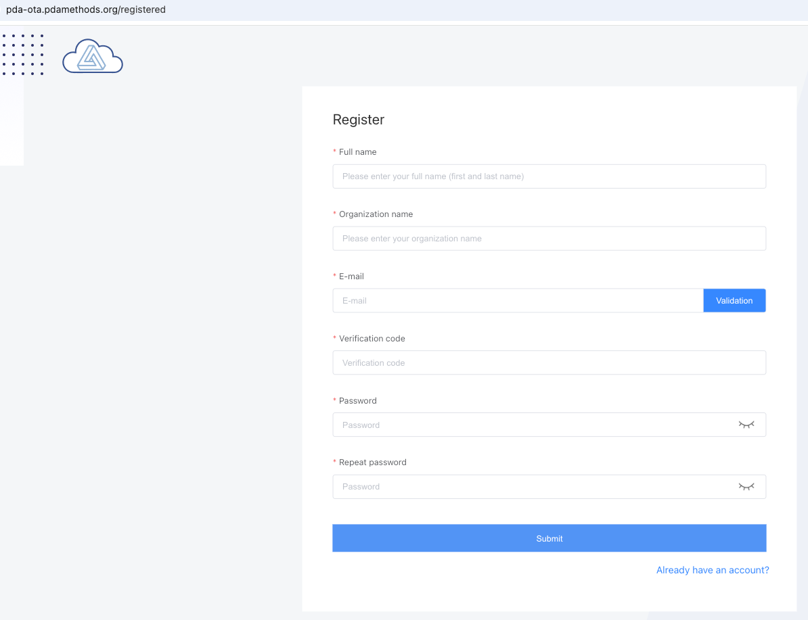
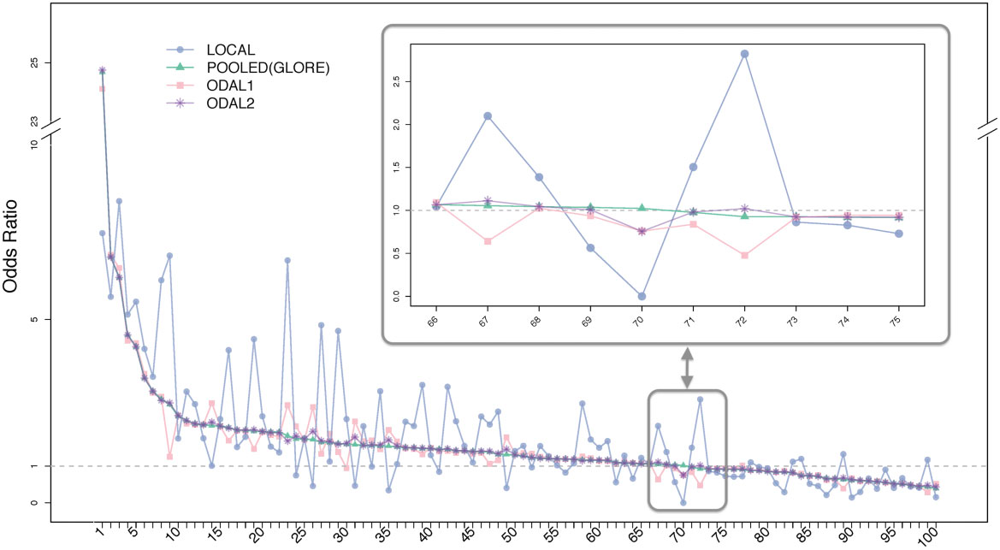

```{r setup, include=FALSE}
knitr::opts_chunk$set(echo = T)
require(data.table)
require(table1)
require(survival)
require(ggplot2)
require(lme4)
setwd('/Users/chongliang/Dropbox/PDA-git/UNMC_workshop/tutorial/')

# require(devtools)
require(remotes)
install_github('https://github.com/Penncil/pda')
require(pda)
source("../run_examples/pda_wrapper.R")

```

## About this tutorial

This tutorial is a hands-on practice of using Privacy-preserving Distributed Algorithms (PDA) to run statistical analysis using data from multiple sites in a research network. The PDA framework includes algorithms for various statistical models, and this tutorial uses `ODAL`, `ODACH` and `DLMM` as examples. Throughout this tutorial we will use synthetic data that mimics the real data in the publications listed below. 

-   ODAL (One-shot Distributed Algorithm for Logistic regression)
  [Publication](https://doi.org/10.1093/jamia/ocz199)
  
-   ODACH (One-shot Distributed Algorithm for Cox regression with Heterogeneity)
 [Publication](https://www.nature.com/articles/s41598-022-09069-0)

-   DLMM (Distributed Linear Mixed-effects Model)
  [Publication](https://www.nature.com/articles/s41467-022-29160-4)
  
The in-person attendees will be grouped into 4 teams (i.e. "sites" in a research network), namely the 4 University of Nebraska campuses (Medical Center, Lincoln, Omaha, and Kearney).  The teams will walk through the pda workflow and mimic real federated learning projects. The interactive data communication is conducted using the secure PDA-OTA (over-the-air, [Link](https://pda-ota.pdamethods.org/login)) cloud platform. For each team, please register ONE pda-ota account to be used for data communication. 

 
## PDA-OTA project setup
In the OTA platform...

```{r, out.width='70%', fig.align='center', fig.cap='...', echo=F} 

```


 
## ODAL practice: fetal loss and medication use
### A recap of the publication
The ODAL (One-shot Distributed Algorithm for Logistic regression) method was published at JAMIA in 2020. ODAL effectively utilizes the information from the lead site (where the patient-level
data are accessible) and incorporates the aggregate data (i.e. the first- and second-order gradients of the likelihood
function) from other sites to construct an estimator without requiring iterative communication across sites
or transferring patient-level data. ODAL was evaluated via simulation and a study on fetal loss and use of 100 medications with EHR data from the University of Pennsylvania Health System. The estimation accuracy was evaluated by comparing it with the gold standard estimator based on the pooled individual participant data (IPD).

```{r, out.width='80%', fig.align='center', fig.cap='Duan 2020 JAMIA, Figure 5', echo=F} 

```

Among the 10 identified “harmful” drugs, 6 were category D or X (meaning have known evidence of increase fetal loss risk, based on the FDA's A-X category system), with 4 being known contraceptives. Three drugs were category
C pain relievers. In the 10 medications that are “protective” of fetal loss, 8 are prenatal vitamins, as well as folic
acid, that are commonly considered beneficial for pregnancy. In summary, the ODAL algorithms provide estimates that are
highly consistent with the pooled estimates, and the identified associations are consistent with current understanding of these medications.


### Data summary
For simplicity of this practice, we will use a synthetic data of fetal loss `FetalLoss` and ONE category X medication `MedX`. Other risk factors include `Race`, `Age`, `Weight`, and `BMI`. The data are from 4 sites, e.g.`MedicalCenter`, `Lincoln`, `Omaha`, and `Kearney`. The data is summarized as below.


```{r fetal_loss_data}
fetal_loss = readRDS('/Users/chongliang/Dropbox/PDA-git/UNMC_workshop/data/fetal_loss.rds')
site.name = c('MedicalCenter', 'Lincoln', 'Omaha', 'Kearney')
head(fetal_loss) 
table1(~factor(FetalLoss)+factor(MedX)+Race+Age+Weight+BMI|site, fetal_loss)
```

We will use the logistic regression model to estimate the odds ratio (OR) of the risk factors on fetal loss. First, assume we have all the patients data pooled together, we can run a pooled logistic regression. This will give us gold-standard estimator.

```{r, fetal_loss_pooled, echo=T}
fit.pooled = glm(FetalLoss~MedX+Race+Age+Weight+BMI, family='binomial', data=fetal_loss)
round(summary(fit.pooled)$coef, 3)
bpool = round(summary(fit.pooled)$coef[,1], 4)
sepool = round(summary(fit.pooled)$coef[,2], 4)
# rbind(bpool, sepool)
```

Next, we look at another commonly used federated learning, i.e. fit logistic regression at each site, then average the estimators with inverse variances as weights. This is called the **meta**-estimator (as in a meta-analysis).
```{r, fetal_loss_each, echo=T} 
K = length(site.name)
bi = sei = c()  
for(sid in site.name){
  fit.i = glm(FetalLoss~MedX+Race+Age+Weight+BMI, family='binomial', data=fetal_loss[site==sid,])
  cat(sid, '\n')
  print(round(summary(fit.i)$coef, 3))
  bi = cbind(bi, summary(fit.i)$coef[,1])
  sei = cbind(sei, summary(fit.i)$coef[,2])
} 
```

Notice that site `Kearney` has no Asian patients, thus the coefficient for Asian is not available. We manually set it as `NA` in order to obtain a valid meta-estimator.
```{r, fetal_loss_meta, echo=T}
bi[,4] = c(bi[1:3,4],NA,bi[4:7,4]) 
sei[,4] = c(sei[1:3,4],NA,sei[4:7,4]) 
bmeta = round(rowSums(bi/sei^2,na.rm=T)/rowSums(1/sei^2,na.rm=T), 4)
semeta = round(sqrt(1/rowSums(1/sei^2,na.rm=T)), 4)
```

The meta-estimator is biased to the pooled estimator.
```{r, fetal_loss_pooled_meta, echo=T}
cbind(bpool, bmeta) 
```

### ODAL workflow
We now use ODAL to conduct a federated logistic regression. ODAL combined the IPD from the lead site and AD from the collaborating sites. We assume `MedicalCenter` is the **lead** site and the other 3 sites (`Lincoln`, `Omaha`, `Kearney`) are the collaborating sites. The diagram below demonstrate the ODAL workflow.

```{r, out.width='90%', fig.align='center', fig.cap='...', echo=F}
# knitr::include_graphics('images/hex-rmarkdown.png')
knitr::include_graphics('https://github.com/Penncil/pda/blob/master/Picture1.png?raw=true')
```

The ODAL workflow starts with setting up a `control` file for coordinating all the calculation and data communication between sites.  This `control` file should be decided by all the sites.
 
```{r odal_control}
control <- list(project_name = 'Medication use and fetal loss (ODAL)',
                sites = c('MedicalCenter', 'Lincoln', 'Omaha', 'Kearney'),
                lead_site = 'MedicalCenter', 
                step = 'initialize',
                model = 'ODAL',
                family = 'binomial',
                heterogeneity = FALSE,
                outcome = 'FetalLoss',
                variables = c('MedX', 'Race', 'Age', 'Weight', 'BMI'),
                variables_lev = list(Race=c('White', 'Black', 'Asian', 'Other')),
                init_method = "meta",   
                optim_maxit = 100,
                optim_method = 'BFGS',
                upload_date = as.character(Sys.time()) )

fetal_loss_split = split(fetal_loss,by='site')
```

The lead site upload the `control` file in the pda-ota cloud.
```{odal_control}
pda(site_id = 'site1', control=control, dir=getwd() )
```

Then each collaborating sites can execute the `initialize` step by calculating AD using their own IPD. They can review the AD before sending it out to the cloud.
```{odal_initialize}
pda(site_id = 'MedicalCenter', ipdata = fetal_loss_split[[1]], dir=getwd() )
```

After all collaborating sites completed the `initialize` step, the lead site can proceed to the `derive` step, by setting the initial estimate `beta_init` as the meta estimate (i.e. inverse-variance weighted average) in the `control` file. 
```{odal_initialize}
pda(site_id = 'Omaha', ipdata = fetal_loss_split[[1]], dir=getwd() )
```

Then each collaborating sites can execute the `derive` step by calculating AD using their own IPD. They can review the AD before sending it out to the cloud.
```{odal_initialize}
pda(site_id = 'Kearney', ipdata = fetal_loss_split[[3]], dir=getwd() )
```

After all collaborating sites completed the `derive` step, the lead site can proceed to the `estimate` step, by constructing the surrogate likelihood and obtaining the ODAL estimate `btilde` and  `setilde`. 
```{odal_initialize}
pda(site_id = 'MedicalCenter', ipdata = fetal_loss_split[[1]], dir=getwd() )
```

The PDA-ODAL is now completed. We can stop now, or we can optionally proceed to the `synthesize` step and allow each collaborating site to calculating their own ODAL estimate by using their own IPD to construct the surrogate likelihood.
```{odal_initialize}
pda(site_id = 'Omaha', ipdata = fetal_loss_split[[2]], dir=getwd() )
```

Now let's compare the ODAL estimate with pooled and meta-estimates.
```{r ODAL_CI_plot, out.width='120%',  echo = F, warning = F}
# hide this plot in the tutorial? show it during the workshop run
# make some plots here
# source("~/Dropbox/PDA-git/pda/R/ODAL.R")
# source("~/Dropbox/PDA-git/pda/R/pda.R")
# source("/Users/chongliang/Dropbox/PDA-git/UNMC_workshop/pda_wrapper.R")
res = run_ODAL_with_pda(control, mydir=getwd(), fetal_loss_split, upload_without_confirm=T, silent_message=T)

Xname = c("MedX", "RaceBlack", 'RaceAsian', 'RaceOther', "Age", "Weight", "BMI")
px = length(Xname)
methods <- c('pooled', 'meta', 'ODAL')   
nm <- length(methods)
ci.df <- data.frame(method = rep(methods, each=px),       
                    risk.factor= rep(Xname, nm),
                    beta=as.numeric(c(bpool[-1], bmeta[-1], res$btilde[-1])),  
                    sd=as.numeric(c(sepool[-1], semeta[-1], res$setilde[-1])),          
                    goldstandard=as.numeric(rep(bpool[-1], nm)))
ci.df$method <- factor(ci.df$method, levels = rev(methods)) 
ci.df$risk.factor <- factor(ci.df$risk.factor, levels = Xname)  
case = 'Fetal loss study'

ggplot(ci.df, aes(x=method, y=beta, shape=method,color=method, group=risk.factor)) +
geom_errorbar(aes(ymin=beta-1.96*sd, ymax=beta+1.96*sd), width=0.1) +
geom_line() +
geom_hline(aes(yintercept=goldstandard), linetype = "dashed") +
geom_point(size=1.5) + 
facet_wrap(. ~ risk.factor
           , scales= "free"  #  "fixed" # 
           , ncol=3)+
labs(title= case, # case, # paste0(case,', 95% confidence intervals of effect size estimates'),
     x =  '', y = "Effect size (log odds ratio)" ) +
theme_bw() +
theme(plot.title = element_text(hjust = 0.5)
      , axis.ticks.x = element_blank()
      , strip.text.x = element_text(size = 14)
      , panel.grid.major = element_blank()
      # , panel.grid.minor = element_blank()
      , axis.title.y = element_text(size=9)
      , axis.text.x = element_text(size=9)
      , axis.text.y = element_text(size=9)
      # , panel.border = element_rect()
      # , axis.text.x = element_blank()
      # , axis.text.x = element_text(angle=30, hjust=1)
      , legend.position = c(0.7, 0.13)
      , legend.title = element_blank()
      # , legend.direction = "horizontal"
      # , legend.key = element_rect(size=0.05)
      # , legend.key.size= unit(3, "line")
      # , legend.key = element_rect(size=9)
      , legend.text=element_text(size=15)
      # , legend.key.width = unit(0.05, "line")
      , legend.key.height = unit(1.5, "line")
) + coord_flip()

```

 


## ODACH practice: opioid use disorder
### A recap of the publication
The ODACH (One-shot Distributed Algorithm for Cox regression with Heterogeneity) method was published at Scientific Report in 2022. ODACH  

 
 


### Data summary
For simplicity of this practice, we will use a synthetic data of opioid use disorder `OUD` and risk factors include `Age`, `Gender`,  `RACE_NHW`, `Smoking`, `CCI`, `Depression`, and `Pain`. The data are from 4 sites, e.g.`MedicalCenter`, `Lincoln`, `Omaha`, and `Kearney`. The data is summarized as below.


```{r OUD_data}
OUD = readRDS('/Users/chongliang/Dropbox/PDA-git/UNMC_workshop/data/OUD.rds')
site.name = c('MedicalCenter', 'Lincoln', 'Omaha', 'Kearney')
head(OUD) 
table1(~time +factor(status) +age +factor(gender) +factor(RACE_NHW) +
         factor(smoking) +CCI+factor(depression) +factor(pain)|site, data=OUD)
```

We will use the Cox proportional hazards regression model to estimate the hazard ratio (HR) of the risk factors on OUD. Cox PH regression is the most commonly used model for time-to-event outcome. As we are dealing with data from multiple sites, we will use Cox regression stratified by sites as it flexibly allows the baseline hazard functions to be different across sites. First, assume we have all the patients data pooled together and run a pooled Cox regression stratified by sites. This will give us the gold-standard estimator.

```{r, OUD_pooled, echo=T}
fit.pooled = coxph(Surv(time, status)~age+gender+RACE_NHW+smoking+CCI+depression+pain+strata(site), data=OUD)
round(summary(fit.pooled)$coef, 3)
bpool = round(summary(fit.pooled)$coef[,1], 4)
sepool = round(summary(fit.pooled)$coef[,3], 4)

```

Next, we look at the **meta**-estimator (as in a meta-analysis).
```{r, OUD_each, echo=T} 
K = length(site.name)
bi = sei = c()  
for(sid in site.name){
  fit.i = coxph(Surv(time, status)~age+gender+RACE_NHW+smoking+CCI+depression+pain, data=OUD[site==sid,])
  cat(sid, '\n')
  print(round(summary(fit.i)$coef, 3))
  bi = cbind(bi, summary(fit.i)$coef[,1])
  sei = cbind(sei, summary(fit.i)$coef[,3])
} 
bmeta = round(rowSums(bi/sei^2,na.rm=T)/rowSums(1/sei^2,na.rm=T), 4)
semeta = round(sqrt(1/rowSums(1/sei^2,na.rm=T)), 4)
 
```
 
The meta-estimator is biased to the pooled estimator.
```{r, OUD_pooled_meta, echo=T}
cbind(bpool, bmeta) 
```

### ODACH workflow
We now use ODACH to conduct a federated Cox regression. Similar to ODAL, ODACH combined the IPD from the lead site and AD from the collaborating sites. We assume `MedicalCenter` is the **lead** site and the other 3 sites (`Lincoln`, `Omaha`, `Kearney`) are the collaborating sites.  The ODACH workflow starts with setting up a `control` file for coordinating all the calculation and data communication between sites.  This `control` file should be decided by all the sites.
 
```{r odach_control}
control <- list(project_name = 'Opioid use disorder (ODACH)',
                sites = c('MedicalCenter', 'Lincoln', 'Omaha', 'Kearney'),
                lead_site = 'MedicalCenter', 
                step = 'initialize',
                model = 'ODAC',
                family = 'cox',
                heterogeneity = T,
                outcome = 'Surv(time, status)',
                variables = c("age","gender","RACE_NHW","smoking","CCI","depression","pain"),
                # variables_lev = list(Race=c('White', 'Black', 'Asian', 'Other')),
                init_method = "meta",   
                optim_maxit = 100,
                optim_method = 'BFGS',
                upload_date = as.character(Sys.time()) )
OUD_split = split(OUD, by='site')

```

The lead site upload the `control` file in the pda-ota cloud.
```{odach_control}
pda(site_id = 'MedicalCenter', control=control, dir=getwd() )
```

Then each collaborating sites can execute the `initialize` step by calculating AD using their own IPD. They can review the AD before sending it out to the cloud.
```{odach_initialize}
pda(site_id = 'Kearney', ipdata = OUD_split[[1]], dir=getwd() )
```

After all collaborating sites completed the `initialize` step, the lead site can proceed to the `derive` step, by setting the initial estimate `beta_init` as the meta estimate (i.e. inverse-variance weighted average) in the `control` file. 
```{odach_initialize}
pda(site_id = 'Lincoln', ipdata = OUD_split[[1]], dir=getwd() )
```

Then each collaborating sites can execute the `derive` step by calculating AD using their own IPD. They can review the AD before sending it out to the cloud.
```{odach_initialize}
pda(site_id = 'Omaha', ipdata = OUD_split[[3]], dir=getwd() )
```

After all collaborating sites completed the `derive` step, the lead site can proceed to the `estimate` step, by constructing the surrogate likelihood and obtaining the ODACH estimate `btilde` and  `setilde`. 
```{odach_initialize}
pda(site_id = 'MedicalCenter', ipdata = OUD_split[[1]], dir=getwd() )
```

The PDA-ODACH is now completed. We can stop now, or we can optionally proceed to the `synthesize` step and allow each collaborating site to calculating their own ODACH estimate by using their own IPD to construct the surrogate likelihood.
```{odach_initialize}
pda(site_id = 'Omaha', ipdata = fetal_loss_split[[2]], dir=getwd() )
```

Now let's compare the ODAL estimate with pooled and meta-estimates.
```{r ODACH_CI_plot, out.width='120%',  echo = F, warning = F}
res = run_ODACH_with_pda(control, mydir=getwd(), OUD_split, upload_without_confirm=T, silent_message=T)

Xname = c("Age 65+", "Gender male", "Race NHW", "Smoking", "CCI", "Depression", "Pain")
px = length(Xname)
methods <- c('pooled', 'meta', 'ODACH')   
nm <- length(methods)
ci.df <- data.frame(method = rep(methods, each=px),       
                    risk.factor= rep(Xname, nm),
                    beta=as.numeric(c(bpool, bmeta, res$btilde)),  
                    sd=as.numeric(c(sepool, semeta, res$setilde)),          
                    goldstandard=as.numeric(rep(bpool, nm)))
ci.df$method <- factor(ci.df$method, levels = rev(methods)) 
ci.df$risk.factor <- factor(ci.df$risk.factor, levels = Xname)  
case = 'Opioid use disorder study'

ggplot(ci.df, aes(x=method, y=beta, shape=method,color=method, group=risk.factor)) +
geom_errorbar(aes(ymin=beta-1.96*sd, ymax=beta+1.96*sd), width=0.1) +
geom_line() +
geom_hline(aes(yintercept=goldstandard), linetype = "dashed") +
geom_point(size=1.5) + 
facet_wrap(. ~ risk.factor , scales= "free", ncol=3)+  #  "fixed" #  
labs(title= case, x =  '', y = "Effect size (log odds ratio)" ) +
theme_bw() +
theme(plot.title = element_text(hjust = 0.5)
      , axis.ticks.x = element_blank()
      , strip.text.x = element_text(size = 14)
      , panel.grid.major = element_blank() 
      , axis.title.y = element_text(size=9)
      , axis.text.x = element_text(size=9)
      , axis.text.y = element_text(size=9) 
      , legend.position = c(0.7, 0.13)
      , legend.title = element_blank() 
      , legend.text=element_text(size=15) 
      , legend.key.height = unit(1.5, "line")
) + coord_flip()

```


## DLMM practice: COVID-19 hospitalization length of stay
### A recap of the publication
In Luo, et al. 2020, the proposed DLMM method is used to study the association between COVID-19 hospitalization length of stay (LOS) and various risk factors.  a lossless ...

### Data summary
The COVID-19 hospitalization length of stay (LoS) data contains... 
For simplicity of this practice, we will use a synthetic data of LOS `COVID_LOS` and a number of risk factors including `Age`, `CCI`, `Gender`, `Admission` quarter in 2020, and comorbidities `Cancer`, `COPD`, `Hyperlipidemia`, `Hypertension`, `KidneyDisease`, `Obesity`, `HeartDisease`, and `Diabetes`. The data are from 4 sites, e.g.`MedicalCenter`, `Lincoln`, `Omaha`, and `Kearney`. The data is summarized as below.


```{r LOS_data}
COVID_LOS = readRDS('/Users/chongliang/Dropbox/PDA-git/UNMC_workshop/data/COVID_LOS.rds')
site.name = c('MedicalCenter', 'Lincoln', 'Omaha', 'Kearney')
head(COVID_LOS) 
table1(~LOS+Age+CCI+Gender+Admission+factor(Cancer)+factor(COPD)+factor(Hyperlipidemia)+factor(Hypertension)+
         factor(KidneyDisease)+factor(Obesity)+factor(HeartDisease)+factor(Diabetes)|site, data=COVID_LOS)
```

From the summary we see that the average LOS are vastly different across sites, so are the risk factors.

We will use the linear mixed-effects model (LMM) to estimate the effects of the risk factors on the LOS. The mixed-effects in LMM allows the intercepts and the effects of risk factors to be different across sites, hence is an ideal model for handling the heterogeneity across this multi-site data. First, assume we have all the patients data pooled together and run a pooled LMM.  

```{r, LOS_pooled, echo=T}
fit.pooled <- lme4::lmer(LOS~Age+CCI+Gender+Admission+Cancer+COPD+Hyperlipidemia+Hypertension+
                          KidneyDisease + Obesity + HeartDisease + Diabetes +
                          (1|site), REML = F, data=COVID_LOS)
round(summary(fit.pooled)$coef, 3)
bpool = round(summary(fit.pooled)$coef[,1], 4)
sepool = round(summary(fit.pooled)$coef[,2], 4)

```

<!-- Next, we look at the **meta**-estimator (as in a meta-analysis). -->
<!-- ```{r, LOS_each, echo=T}  -->
<!-- K = length(site.name) -->
<!-- bi = sei = c()   -->
<!-- for(sid in site.name){ -->
<!--   fit.i = coxph(Surv(time, status)~age+gender+RACE_NHW+smoking+CCI+depression+pain, data=OUD[site==sid,]) -->
<!--   cat(sid, '\n') -->
<!--   print(round(summary(fit.i)$coef, 3)) -->
<!--   bi = cbind(bi, summary(fit.i)$coef[,1]) -->
<!--   sei = cbind(sei, summary(fit.i)$coef[,3]) -->
<!-- }  -->
<!-- bmeta = round(rowSums(bi/sei^2,na.rm=T)/rowSums(1/sei^2,na.rm=T), 4) -->
<!-- semeta = round(sqrt(1/rowSums(1/sei^2,na.rm=T)), 4) -->
<!-- ``` -->
<!-- The meta-estimator is biased to the pooled estimator. -->
<!-- ```{r, OUD_pooled_meta, echo=T} -->
<!-- cbind(bpool, bmeta)  -->
<!-- ``` -->

### DLMM workflow
We now use DLMM to conduct a federated analysis. The best part about DLMM is that, Similar to ODAL, ODACH combined the IPD from the lead site and AD from the collaborating sites. We assume `MedicalCenter` is the **lead** site and the other 3 sites (`Lincoln`, `Omaha`, `Kearney`) are the collaborating sites.  The ODACH workflow starts with setting up a `control` file for coordinating all the calculation and data communication between sites.  This `control` file should be decided by all the sites.
 
```{r dlmm_control}
control <- list(project_name = 'COVID hospitalization length of stay (DLMM)',
                sites = c('MedicalCenter', 'Lincoln', 'Omaha', 'Kearney'),
                lead_site = 'MedicalCenter', 
                step = 'initialize',
                model = 'DLM',
                family = 'gaussian',
                heterogeneity = T,
                heterogeneity_effect = 'random', 
                outcome = 'LOS',
                variables = c("Age","CCI","Gender","Admission","Cancer","COPD","Hyperlipidemia","Hypertension", 
                              "KidneyDisease",  "Obesity","HeartDisease","Diabetes"),
                variables_lev = list(Age=c('18-64','65-80','80+'), 
                                     CCI=c('0-1','2-5','5+'), Admission=c('Q1','Q2','Q3')),
                variables_heterogeneity = c('Intercept'),
                optim_maxit = 100,
                upload_date = as.character(Sys.time()) )
COVID_LOS_split = split(COVID_LOS, by='site' )

```

The lead site upload the `control` file in the pda-ota cloud.
```{dlmm_control}
pda(site_id = 'MedicalCenter', control=control, dir=getwd() )
```

Then each collaborating sites can execute the `initialize` step by calculating AD using their own IPD. They can review the AD before sending it out to the cloud.
```{dlmm_initialize}
pda(site_id = 'Kearney', ipdata = COVID_LOS_split[[1]], dir=getwd() )
```

After all collaborating sites completed the `initialize` step, the lead site can proceed to the `estimate` step. 
```{dlmm_estimate}
pda(site_id = 'MedicalCenter', ipdata = COVID_LOS_split[[1]], dir=getwd() )
```

Comparing the estimates, they are effectively identical. 
```{r dlmm_compare}
res = run_DLMM_with_pda(control, mydir=getwd(), mydata=COVID_LOS_split, upload_without_confirm=T, silent_message=T)

# fixed effects
cbind(bpool, bdlmm=res$bhat, sepool, sedlmm=res$sebhat)

# var component
cbind(data.frame(summary(fit.pooled)$varcor)$vcov, 
      c(res$Vhat, res$sigmahat^2) )

# random intercepts (BLUP)
cbind(u.pool = ranef(fit.pooled)$site, u.dlmm = c(res$uhat))

```


DLMM can also be used to test the significance of random effects. Here we take an example of testing the random effects of Gender on LOS. We first test it via the pooled data LMM.

```{r gender_lrt_pooled}
## Chi-sq test for Gender random effect (likelihood ratio test, LRT)
COVID_LOS[,Gender:=ifelse(Gender=='F',0,1)] # create dummy var 
fit.pooled1 <- lme4::lmer(LOS~Age+CCI+Gender+Admission+Cancer+COPD+Hyperlipidemia+Hypertension+
                            KidneyDisease + Obesity + HeartDisease + Diabetes +
                            (1|site)+(0+Gender|site), REML = F, data=COVID_LOS)
anova(fit.pooled, fit.pooled1) 
```

Next we test it via DLMM. Notice this does not require other AD, just refit DLMM using the same AD.
```{r gender_lrt_dlmm}
# Chi-sq test for Gender random effect, via DLMM
control$variables_heterogeneity = c('Intercept', "Gender")
res1 = run_DLMM_with_pda(control, mydir=getwd(), mydata=COVID_LOS_split, upload_without_confirm=T, silent_message=T)
1 - pchisq((res1$lik - res$lik)*2, df=1) # p-value
```

We see the p-values are effectively identical. We can also compare the estimated variance components, and random effects.
```{r gender_lrt_compare}
# var component
cbind(VC.pool=data.frame(summary(fit.pooled1)$varcor)$vcov, 
      VC.dlmm=c(diag(res1$Vhat), res1$sigmahat^2) )

# random effects (BLUP): intercepts and Gender effects
cbind(u.pool1 = round(ranef(fit.pooled1)$site,4),
      u.dlmm1.Intercept = res1$uhat[,1],
      u.dlmm1.Gender = res1$uhat[,2])
```


- Duan R, Boland MR, Liu Z, Liu Y, Chang HH, Xu H, Chu H, Schmid CH, Forrest CB, Holmes JH, Schuemie MJ, Berlin JA, Moore JH, Chen Y. Learning from electronic health records across multiple sites: A communication-efficient and privacy-preserving distributed algorithm. J Am Med Inform Assoc. 2020 Mar 1;27(3):376-385. doi: 10.1093/jamia/ocz199. PMID: 31816040; PMCID: PMC7025371. 
- Luo C, Duan R, Naj AC, Kranzler HR, Bian J, Chen Y. ODACH: a one-shot distributed algorithm for Cox model with heterogeneous multi-center data. Sci Rep. 2022 Apr 22;12(1):6627. doi: 10.1038/s41598-022-09069-0. PMID: 35459767; PMCID: PMC9033863. 
- Luo C, Islam MN, Sheils NE, Buresh J, Reps J, Schuemie MJ, Ryan PB, Edmondson M, Duan R, Tong J, Marks-Anglin A, Bian J, Chen Z, Duarte-Salles T, Fernández-Bertolín S, Falconer T, Kim C, Park RW, Pfohl SR, Shah NH, Williams AE, Xu H, Zhou Y, Lautenbach E, Doshi JA, Werner RM, Asch DA, Chen Y. DLMM as a lossless one-shot algorithm for collaborative multi-site distributed linear mixed models. Nat Commun. 2022 Mar 30;13(1):1678. doi: 10.1038/s41467-022-29160-4. PMID: 35354802; PMCID: PMC8967932.